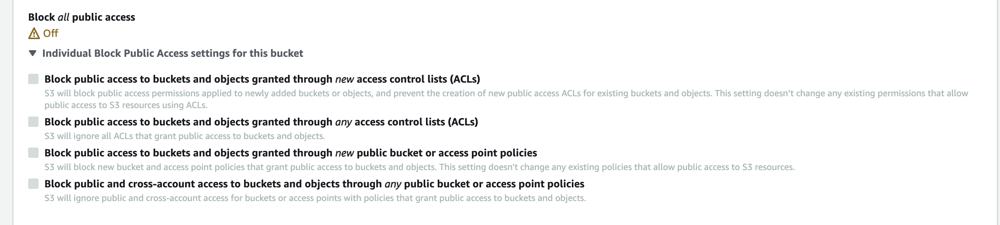

# Configuration

## Firebase

Generate a private key file for your service account.

1. Go to Firebase console - https://console.firebase.google.com/$projectId
2. Open Settings > Service Accounts.
3. Click Generate New Private Key, then confirm by clicking Generate Key.

Copy the JSON as a value to `FIREBASE_ADMIN_CREDENTIALS` in environment file

```
FIREBASE_ADMIN_CREDENTIALS={"type": "service_account", "project_id": "projectId", "private_key_id": "***123***", "private_key": "***private-key***", "client_email": "email", "client_id": "clientId", "auth_uri": "https://accounts.google.com/o/oauth2/auth", "token_uri": "https://oauth2.googleapis.com/token", "auth_provider_x509_cert_url": "https://www.googleapis.com/oauth2/v1/certs", "client_x509_cert_url": "cert_url", "universe_domain": "googleapis.com"}

```

## AWS

For AWS if you are using a service account to run this image give the machine an IAM role as follows.
```
{
   "Version":"2012-10-17",
   "Statement":[
      {
         "Effect":"Allow",
         "Action":[
            "s3:PutObject",
            "s3:PutObjectAcl",
            "s3:GetObject",
            "s3:GetObjectAcl",
            "s3:DeleteObject"
         ],
         "Resource":"arn:aws:s3:::S3_BUCKET/*"
      }
   ]
}
```

Alternatively you can also provide the following as environment variables in the .env files to use a specific account.
```
AWS_ACCESS_KEY_ID=
AWS_SECRET_ACCESS_KEY=
```

The S3 bucket needs to have the following bucket policy.
You will need to disable all following checkboxes




```
{
    "Version": "2012-10-17",
    "Statement": [
        {
            "Sid": "AllowPublicReadAccessToDigiaPublic",
            "Effect": "Allow",
            "Principal": "*",
            "Action": "s3:GetObject",
            "Resource": "arn:aws:s3:::S3_BUCKET/digia/public/*"
        }
    ]
}
```


# Building and Running


Build using - `docker build .`

To run for prod

`docker run -p 3000:3000 -e env=prod --env-file=configs/.production.env $IMAGE_ID`

To run for dev

`docker run -p 3000:3000 -e env=dev --env-file=configs/.development.env $IMAGE_ID`

## For ARM

Updated Dockerfile to use our ARM based builds

`FROM public.ecr.aws/digia/digia-backend:1.1.0-arm64`

Build using the platform flag

`docker build . --platform=linux/arm64`